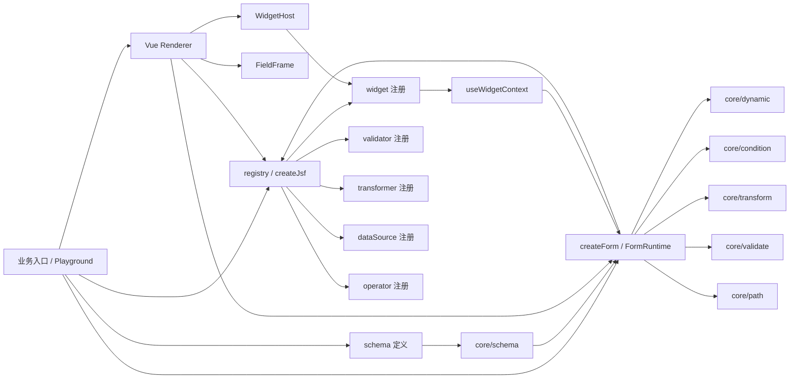
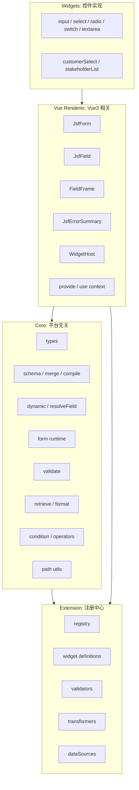
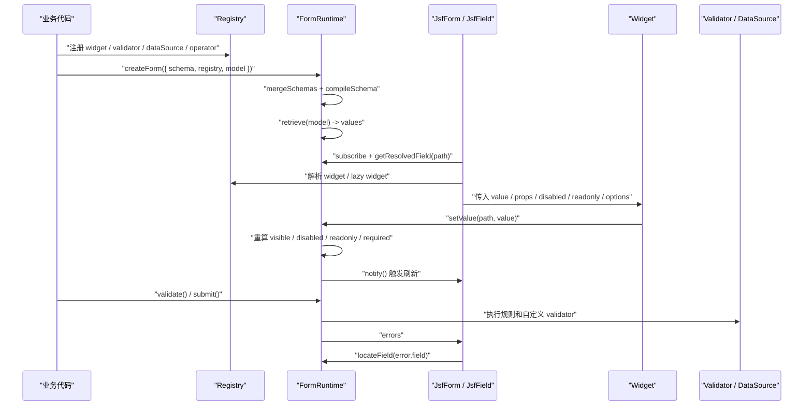

# 模块关系

JSF 当前由四层组成：core、registry、renderer、widget。业务应用只组合这些模块，不直接改 core 内部状态。

## 总览

## 分层职责

## 数据流

## 文件位置

- `jsf/src/core`：平台无关运行时。
- `jsf/src/registry`：扩展注册中心。
- `jsf/src/renderer`：Vue 渲染层。
- `jsf/src/widgets`：基础 Web 控件。
- `web/playground/src/views/jsf`：完整示例。
